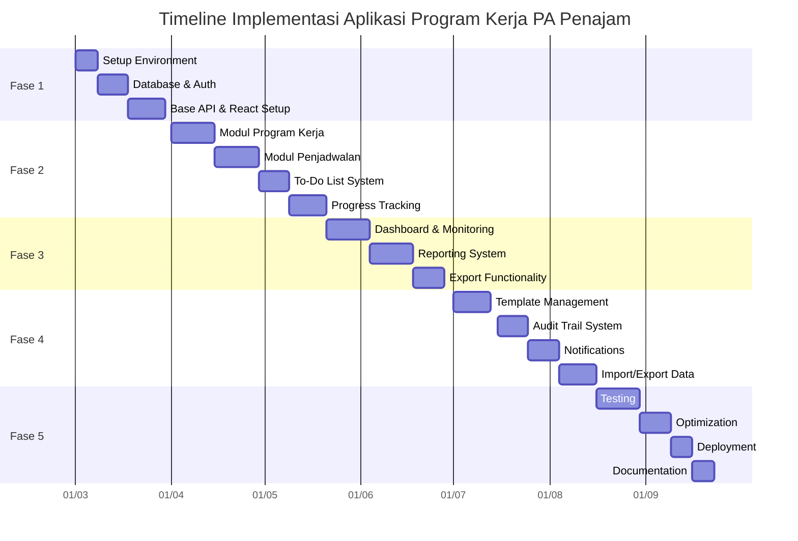

### **Rencana Implementasi Aplikasi "Program Kerja PA Penajam" (Versi yang Disempurnakan)**
## 🗓️ Timeline Implementasi

### ✅ Fase 1: Setup dan Foundation (3-4 Minggu)

#### Environment Setup
- [x] **Setup Development Environment**
  - [x] Install dan konfigurasi Laravel 10+
  - [x] Install dan konfigurasi React 18+
  - [x] Setup database MySQL/MariaDB
  - [x] Konfigurasi environment variables
  - [x] Setup version control (Git)

#### Authentication & Authorization
- [x] **Implementasi Sistem Auth**
  - [x] Setup Laravel Sanctum untuk API authentication
  - [x] Buat login/logout functionality
  - [x] Implementasi password reset system
  - [x] Setup role-based access control (RBAC) menggunakan Laravel Gates atau Policies untuk memastikan otorisasi yang granular pada setiap aksi.

#### Database & API
- [x] **Setup Database**
  - [x] Eksekusi SQL schema yang telah dibuat
  - [x] Setup database seeding untuk data dummy
  - [x] Konfigurasi database migrations

- [x] **Base API Development**
  - [x] Buat base API controllers
  - [x] Implementasi CRUD operations untuk core entities
  - [x] Setup API response formatting

#### Frontend Foundation
- [x] **React Project Setup**
  - [x] Initialize React application
  - [x] Setup routing dengan React Router
  - [x] Configure state management (Redux/Context)
  - [x] Setup UI component library
  - [x] Mendesain wireframe/mockup awal dengan fokus pada alur kerja pengguna (UX) yang efisien, terutama untuk tugas yang sering dilakukan.**

### ✅ Fase 2: Core Modules (6-8 Minggu)

(Tidak ada perubahan di fase ini, namun prinsip UX dari Fase 1 harus diterapkan di sini)

#### Modul Manajemen Program Kerja
- [x] **CRUD Operations**
  - [x] Implementasi multi-tahun program kerja
  - [x] CRUD Kategori Utama dengan validasi
  - [x] CRUD Kegiatan dengan hubungan ke kategori
  - [x] CRUD Rencana Aksi dengan penugasan user
- [x] **User Interface**
  - [x] Design form untuk input data
  - [x] Implementasi data tables dengan pagination
  - [x] Search dan filter functionality

#### Modul Penjadwalan
- [x] **Sistem Jadwal**
  - [x] Implementasi jadwal insidentil (contoh: Karis/Karsu Jan-Des)
  - [x] Implementasi jadwal periodik (contoh: triwulanan)
  - [x] Implementasi jadwal rutin (contoh: mingguan)
  - [x] UI untuk konfigurasi jadwal
- [ ] **Reminder System**
  - [ ] Notifikasi untuk tugas yang akan datang
  - [ ] Alert untuk deadline mendekat

#### Modul To-Do List
- [x] **To-Do Management**
  - [x] CRUD todo items untuk tiap rencana aksi
  - [x] Mark todo sebagai complete/incomplete
  - [x] Prioritization system
  - [x] Deadline management
- [x] **Visual Indicators**
  - [x] Progress bars untuk todo completion
  - [x] Badges untuk status todo
  - [x] Filtering todos by status

#### Modul Progress Tracking
- [x] **Progress Management**
  - [x] Input progress persentase dengan validasi
  - [x] History tracking dengan timeline view
  - [x] Automatic status update (planned → in_progress → completed)
- [x] **Visualization**
  - [x] Progress charts untuk individual tasks
  - [x] Overall progress indicators

### ✅ Fase 3: Monitoring & Reporting (5-6 Minggu)

### Dashboard Utama
- [x] **Overview Dashboard**
  - [x] Summary statistics (total tasks, completed, overdue)
  - [x] Progress charts per kategori
  - [x] Recent activity feed
  - [x] Upcoming deadlines section
- [] **Advanced Filtering**
  - [] Filter by tahun program
  - [] Filter by kategori/kegiatan
  - [] Filter by assigned user
  - [] Filter by status/priority

### Reporting System
- [x] **Laporan Bulanan**
  - [x] Generate monthly progress reports
  - [x] Summary of completed tasks
  - [x] Analysis of overdue tasks
  - [x] Performance metrics
- [x] **Laporan Tahunan**
  - [x] Year-end summary reports
  - [x] Comparative analysis year-over-year
  - [x] Achievement highlights

### Export Functionality
- [x] **Data Export**
  - [x] Export to PDF functionality
  - [x] Export to Excel/CSV
  - [x] Custom report formatting
  - [x] Scheduled report generation

### ✅ Fase 4: Advanced Features (6-7 Minggu)

#### Template Management
- [x] **Template System**
  - [x] CRUD program templates
  - [x] Copy program from previous year
  - [x] Modify templates for new year
  - [x] Mark templates as favorites

- [x] **Template Application**
  - [x] Apply template to new program year
  - [x] Customize template during application
  - [x] Versioning of templates

#### Audit Trail System
- [ ] **Activity Logging**
  - [ ] Track all changes to program data
  - [ ] User action history
  - [ ] Data modification records
- [ ] **Audit Reports**
  - [ ] Generate audit reports
  - [ ] Filter audit logs by user/date/action
  - [ ] Export audit trails

#### Notification System
- [ ] **Real-time Notifications**
  - [ ] In-app notifications
  - [ ] Email notifications for important events
  - [ ] Slack integration (optional)
- [ ] **Notification Preferences**
  - [ ] User configurable notification settings
  - [ ] Digest notifications
  - [ ] Priority-based notifications

#### Import/Export Data
- [ ] **Data Import**
  - [ ] Import from Excel/CSV templates
  - [ ] Implementasi validasi data yang ketat saat impor, dengan feedback error yang jelas dan spesifik kepada pengguna untuk mencegah data inkonsisten.**
  - [ ] Batch import functionality

- [ ] **Data Management**
  - [ ] Backup and restore functionality
  - [ ] Data archiving for previous years
  - [ ] Data cleanup utilities

### ✅ Fase 5: Deployment & Optimization (4-5 Minggu)

#### Testing
- [ ] **Quality Assurance**
  - [ ] Unit testing untuk backend
  - [ ] Integration testing untuk API
  - [ ] End-to-end testing untuk frontend
  - [ ] User acceptance testing (UAT)
- [ ] **Bug Fixing**
  - [ ] Priority-based bug resolution
  - [ ] Regression testing
  - [ ] Performance testing

#### Optimization
- [ ] **Performance Optimization**
  - [ ] Database query optimization
  - [ ] Frontend bundle optimization
  - [ ] Caching strategy implementation
  - [ ] Lazy loading for large datasets
- [ ] **Security Hardening**
  - [ ] Security vulnerability assessment
  - [ ] Input validation strengthening
  - [ ] API security enhancements
  - [ ] Data encryption where needed

#### Deployment
- [ ] **Production Deployment**
  - [ ] Production environment setup
  - [ ] Database migration to production
  - [ ] SSL certificate installation
  - [ ] Setup otomatisasi deployment (CI/CD) menggunakan tools seperti GitHub Actions atau GitLab CI untuk proses rilis yang lebih cepat dan andal.
- [ ] **Post-Deployment**
  - [ ] Monitoring setup (error tracking, performance monitoring)
  - [ ] Backup system configuration
  - [ ] User training materials preparation

#### Documentation
- [ ] **Technical Documentation**
  - [ ] API documentation
  - [ ] Database schema documentation
  - [ ] Deployment guide
  - [ ] Troubleshooting guide
- [ ] **User Documentation**
  - [ ] User manual
  - [ ] Video tutorials
  - [ ] Frequently asked questions (FAQ)