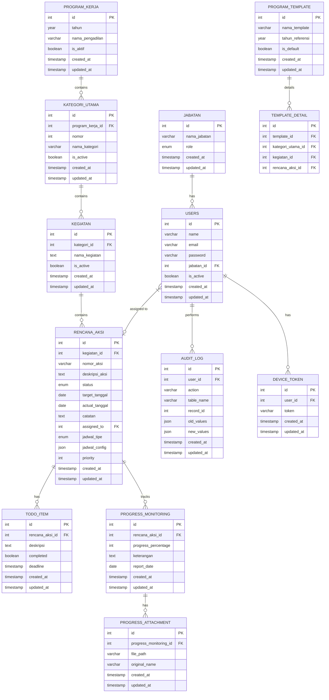

```mermaid
erDiagram
    USERS {
        int id PK
        varchar name
        varchar email
        varchar password
        int jabatan_id FK
        boolean is_active
        timestamp created_at
        timestamp updated_at
    }

    JABATAN {
        int id PK
        varchar nama_jabatan
        enum role
        timestamp created_at
        timestamp updated_at
    }

    PROGRAM_KERJA {
        int id PK
        year tahun
        varchar nama_pengadilan
        boolean is_aktif
        timestamp created_at
        timestamp updated_at
    }

    KATEGORI_UTAMA {
        int id PK
        int program_kerja_id FK
        int nomor
        varchar nama_kategori
        boolean is_active
        timestamp created_at
        timestamp updated_at
    }

    KEGIATAN {
        int id PK
        int kategori_id FK
        text nama_kegiatan
        boolean is_active
        timestamp created_at
        timestamp updated_at
    }

    RENCANA_AKSI {
        int id PK
        int kegiatan_id FK
        varchar nomor_aksi
        text deskripsi_aksi
        enum status
        date target_tanggal
        date actual_tanggal
        text catatan
        int assigned_to FK
        enum jadwal_tipe
        json jadwal_config
        int priority
        timestamp created_at
        timestamp updated_at
    }

    TODO_ITEM {
        int id PK
        int rencana_aksi_id FK
        text deskripsi
        boolean completed
        timestamp deadline
        timestamp created_at
        timestamp updated_at
    }

    PROGRESS_MONITORING {
        int id PK
        int rencana_aksi_id FK
        int progress_percentage
        text keterangan
        date report_date
        timestamp created_at
        timestamp updated_at
    }

    PROGRESS_ATTACHMENT {
        int id PK
        int progress_monitoring_id FK
        varchar file_path
        varchar original_name
        timestamp created_at
        timestamp updated_at
    }

    AUDIT_LOG {
        int id PK
        int user_id FK
        varchar action
        varchar table_name
        int record_id
        json old_values
        json new_values
        timestamp created_at
        timestamp updated_at
    }

    PROGRAM_TEMPLATE {
        int id PK
        varchar nama_template
        year tahun_referensi
        boolean is_default
        timestamp created_at
        timestamp updated_at
    }

    TEMPLATE_DETAIL {
        int id PK
        int template_id FK
        int kategori_utama_id FK
        int kegiatan_id FK
        int rencana_aksi_id FK
    }

    DEVICE_TOKEN {
        int id PK
        int user_id FK
        varchar token
        timestamp created_at
        timestamp updated_at
    }

    JABATAN ||--o{ USERS : "has"
    PROGRAM_KERJA ||--o{ KATEGORI_UTAMA : "contains"
    KATEGORI_UTAMA ||--o{ KEGIATAN : "contains"
    KEGIATAN ||--o{ RENCANA_AKSI : "contains"
    RENCANA_AKSI ||--o{ TODO_ITEM : "has"
    RENCANA_AKSI ||--o{ PROGRESS_MONITORING : "tracks"
    PROGRESS_MONITORING ||--o{ PROGRESS_ATTACHMENT : "has"
    USERS }|--o| RENCANA_AKSI : "assigned to"
    USERS ||--o{ AUDIT_LOG : "performs"
    USERS ||--o{ DEVICE_TOKEN : "has"
    PROGRAM_TEMPLATE ||--o{ TEMPLATE_DETAIL : "details"
```
