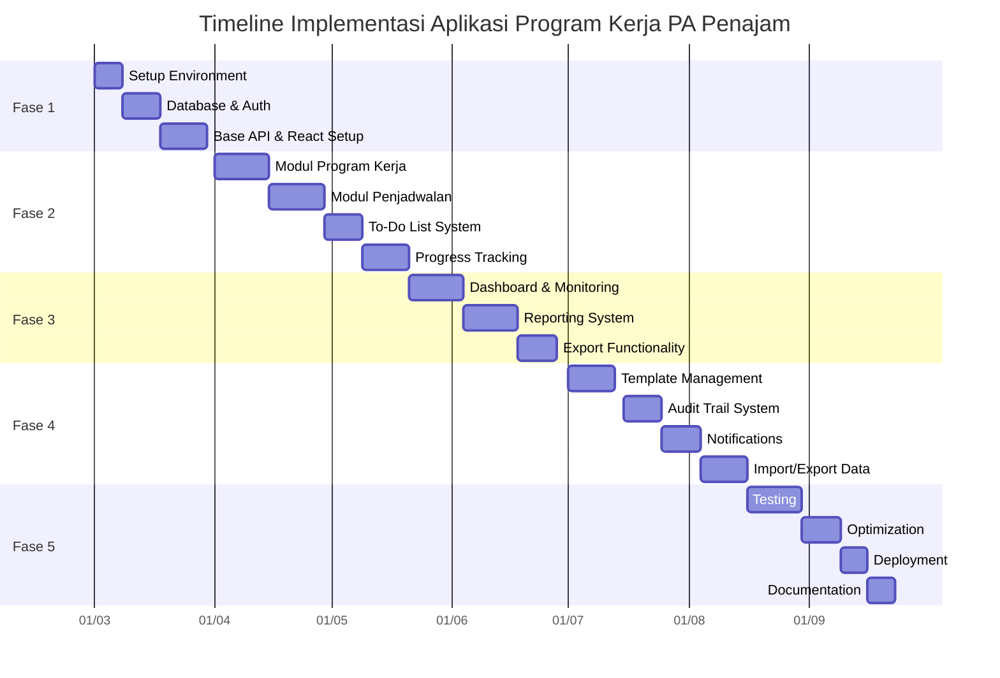

### **Rencana Implementasi Aplikasi "Program Kerja PA Penajam" (Versi yang Disempurnakan)**
## 🗓️ Timeline Implementasi

### ✅ Fase 1: Setup dan Foundation (3-4 Minggu)

#### Environment Setup
- [ ] **Setup Development Environment**
  - [ ] Install dan konfigurasi Laravel 10+
  - [ ] Install dan konfigurasi React 18+
  - [ ] Setup database MySQL/MariaDB
  - [ ] Konfigurasi environment variables
  - [ ] Setup version control (Git)

#### Authentication & Authorization
- [ ] **Implementasi Sistem Auth**
  - [ ] Setup Laravel Sanctum untuk API authentication
  - [ ] Buat login/logout functionality
  - [ ] Implementasi password reset system
  - [ ] Setup role-based access control (RBAC) menggunakan Laravel Gates atau Policies untuk memastikan otorisasi yang granular pada setiap aksi.

#### Database & API
- [ ] **Setup Database**
  - [ ] Eksekusi SQL schema yang telah dibuat
  - [ ] Setup database seeding untuk data dummy
  - [ ] Konfigurasi database migrations

- [ ] **Base API Development**
  - [ ] Buat base API controllers
  - [ ] Implementasi CRUD operations untuk core entities
  - [ ] Setup API response formatting

#### Frontend Foundation
- [ ] **React Project Setup**
  - [ ] Initialize React application
  - [ ] Setup routing dengan React Router
  - [ ] Configure state management (Redux/Context)
  - [ ] Setup UI component library
  - [ ] Mendesain wireframe/mockup awal dengan fokus pada alur kerja pengguna (UX) yang efisien, terutama untuk tugas yang sering dilakukan.**

### ✅ Fase 2: Core Modules (6-8 Minggu)

(Tidak ada perubahan di fase ini, namun prinsip UX dari Fase 1 harus diterapkan di sini)

#### Modul Manajemen Program Kerja
- [ ] **CRUD Operations**
  - [ ] Implementasi multi-tahun program kerja
  - [ ] CRUD Kategori Utama dengan validasi
  - [ ] CRUD Kegiatan dengan hubungan ke kategori
  - [ ] CRUD Rencana Aksi dengan penugasan user
- [ ] **User Interface**
  - [ ] Design form untuk input data
  - [ ] Implementasi data tables dengan pagination
  - [ ] Search dan filter functionality

#### Modul Penjadwalan
- [ ] **Sistem Jadwal**
  - [ ] Implementasi jadwal insidentil (contoh: Karis/Karsu Jan-Des)
  - [ ] Implementasi jadwal periodik (contoh: triwulanan)
  - [ ] Implementasi jadwal rutin (contoh: mingguan)
  - [ ] UI untuk konfigurasi jadwal
- [ ] **Reminder System**
  - [ ] Notifikasi untuk tugas yang akan datang
  - [ ] Alert untuk deadline mendekat

#### Modul To-Do List
- [ ] **To-Do Management**
  - [ ] CRUD todo items untuk tiap rencana aksi
  - [ ] Mark todo sebagai complete/incomplete
  - [ ] Prioritization system
  - [ ] Deadline management
- [ ] **Visual Indicators**
  - [ ] Progress bars untuk todo completion
  - [ ] Badges untuk status todo
  - [ ] Filtering todos by status

#### Modul Progress Tracking
- [ ] **Progress Management**
  - [ ] Input progress persentase dengan validasi
  - [ ] History tracking dengan timeline view
  - [ ] Automatic status update (planned → in_progress → completed)
- [ ] **Visualization**
  - [ ] Progress charts untuk individual tasks
  - [ ] Overall progress indicators

### ✅ Fase 3: Monitoring & Reporting (5-6 Minggu)

### Dashboard Utama
- [ ] **Overview Dashboard**
  - [ ] Summary statistics (total tasks, completed, overdue)
  - [ ] Progress charts per kategori
  - [ ] Recent activity feed
  - [ ] Upcoming deadlines section
- [ ] **Advanced Filtering**
  - [ ] Filter by tahun program
  - [ ] Filter by kategori/kegiatan
  - [ ] Filter by assigned user
  - [ ] Filter by status/priority

### Reporting System
- [ ] **Laporan Bulanan**
  - [ ] Generate monthly progress reports
  - [ ] Summary of completed tasks
  - [ ] Analysis of overdue tasks
  - [ ] Performance metrics
- [ ] **Laporan Tahunan**
  - [ ] Year-end summary reports
  - [ ] Comparative analysis year-over-year
  - [ ] Achievement highlights

### Export Functionality
- [ ] **Data Export**
  - [ ] Export to PDF functionality
  - [ ] Export to Excel/CSV
  - [ ] Custom report formatting
  - [ ] Scheduled report generation

### ✅ Fase 4: Advanced Features (6-7 Minggu)

#### Template Management
- [ ] **Template System**
  - [ ] CRUD program templates
  - [ ] Copy program from previous year
  - [ ] Modify templates for new year
  - [ ] Mark templates as favorites

- [ ] **Template Application**
  - [ ] Apply template to new program year
  - [ ] Customize template during application
  - [ ] Versioning of templates

#### Audit Trail System
- [ ] **Activity Logging**
  - [ ] Track all changes to program data
  - [ ] User action history
  - [ ] Data modification records
- [ ] **Audit Reports**
  - [ ] Generate audit reports
  - [ ] Filter audit logs by user/date/action
  - [ ] Export audit trails

#### Notification System
- [ ] **Real-time Notifications**
  - [ ] In-app notifications
  - [ ] Email notifications for important events
  - [ ] Slack integration (optional)
- [ ] **Notification Preferences**
  - [ ] User configurable notification settings
  - [ ] Digest notifications
  - [ ] Priority-based notifications

#### Import/Export Data
- [ ] **Data Import**
  - [ ] Import from Excel/CSV templates
  - [ ] Implementasi validasi data yang ketat saat impor, dengan feedback error yang jelas dan spesifik kepada pengguna untuk mencegah data inkonsisten.**
  - [ ] Batch import functionality

- [ ] **Data Management**
  - [ ] Backup and restore functionality
  - [ ] Data archiving for previous years
  - [ ] Data cleanup utilities

### ✅ Fase 5: Deployment & Optimization (4-5 Minggu)

#### Testing
- [ ] **Quality Assurance**
  - [ ] Unit testing untuk backend
  - [ ] Integration testing untuk API
  - [ ] End-to-end testing untuk frontend
  - [ ] User acceptance testing (UAT)
- [ ] **Bug Fixing**
  - [ ] Priority-based bug resolution
  - [ ] Regression testing
  - [ ] Performance testing

#### Optimization
- [ ] **Performance Optimization**
  - [ ] Database query optimization
  - [ ] Frontend bundle optimization
  - [ ] Caching strategy implementation
  - [ ] Lazy loading for large datasets
- [ ] **Security Hardening**
  - [ ] Security vulnerability assessment
  - [ ] Input validation strengthening
  - [ ] API security enhancements
  - [ ] Data encryption where needed

#### Deployment
- [ ] **Production Deployment**
  - [ ] Production environment setup
  - [ ] Database migration to production
  - [ ] SSL certificate installation
  - [ ] Setup otomatisasi deployment (CI/CD) menggunakan tools seperti GitHub Actions atau GitLab CI untuk proses rilis yang lebih cepat dan andal.
- [ ] **Post-Deployment**
  - [ ] Monitoring setup (error tracking, performance monitoring)
  - [ ] Backup system configuration
  - [ ] User training materials preparation

#### Documentation
- [ ] **Technical Documentation**
  - [ ] API documentation
  - [ ] Database schema documentation
  - [ ] Deployment guide
  - [ ] Troubleshooting guide
- [ ] **User Documentation**
  - [ ] User manual
  - [ ] Video tutorials
  - [ ] Frequently asked questions (FAQ)